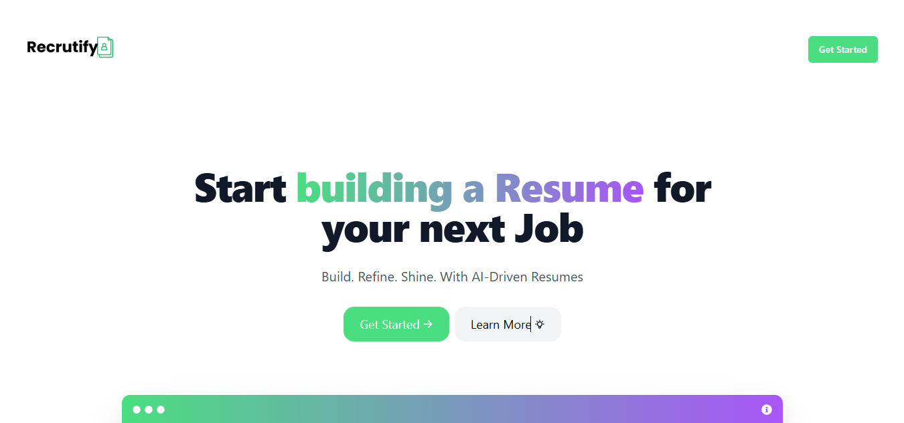
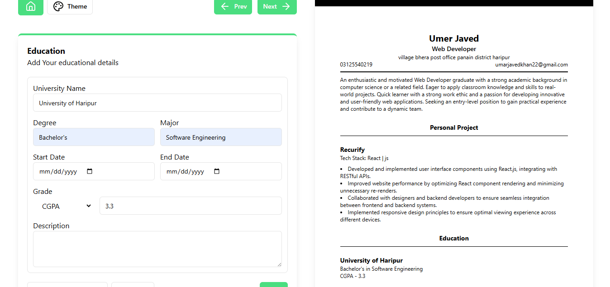

# 🧠 Recurify – AI Resume Builder


Recurify is an advanced web application that uses AI to help you effortlessly create, enhance, and download professional resumes.  
With a modern UI, AI-powered suggestions, and secure user authentication, Recurify streamlines resume building for everyone.

---

## 📌 Index

- [Tech Stack](#tech-stack)
- [Live Demo](#live-demo)
- [Screenshots](#screenshots)
- [Installation](#installation)
  - [Backend Setup](#backend-setup)
  - [Frontend Setup](#frontend-setup)
- [Features](#features)
- [Contribution](#contribution)
- [Developer](#developer)
- [License](#license)

---

## 🛠 Tech Stack

- **Frontend:** React.js, Next.js, Tailwind CSS
- **Backend:** Node.js, Express.js
- **Database:** MongoDB
- **AI Integration:** Gemini (free AI alternative)
- **Authentication:** JWT & Cookies
- **Deployment:** Vercel & Railway

---

## 🌐 Live Demo

- 🔗 **Frontend:** [Recurify App](https://ai-resume-builder-nine-pi.vercel.app/)
- 🔗 **Backend API:** [API Live](https://ai-reume-builder-backend-production.up.railway.app)

---

## 🖼 Screenshots




  



---

## ⚙️ Installation

To run Recurify locally, follow these steps:

### 1️⃣ Clone the repositories

```bash
git clone https://github.com/UmarKhan-codeer/Ai-Resume-Builder-Frontend.git
git clone https://github.com/UmarKhan-codeer/Ai-Resume-Builder-Backend.git

🔧 Backend Setup
Navigate to backend:

bash
cd Ai-Resume-Builder-Backend
npm install
Create .env in root:

env
PORT=5000
MONGODB_URI=your-mongodb-uri
JWT_SECRET_KEY=your-secret-key
JWT_SECRET_EXPIRES_IN=1d
NODE_ENV=Dev
ALLOWED_SITE=http://localhost:3000
Run backend:
bash
npm run dev

💻 Frontend Setup
Navigate to frontend:

bash
cd ../Ai-Resume-Builder-Frontend
npm install
Create .env.local in root:

env
NEXT_PUBLIC_BACKEND=http://localhost:5000
Run frontend:

bash
npm run dev

✨ Features
🔒 Secure Authentication
JWT & cookie-based login and registration

🧠 AI Suggestions
Smart resume content enhancement (powered by Gemini)

📄 PDF Export
Download your resume instantly as PDF

🎨 Beautiful & Responsive UI
Modern design with Tailwind CSS, works on all devices

🏠 Dashboard
Manage and preview your resumes

🤝 Contribution
Contributions are welcome! Follow these steps:

Fork the repo

Create your branch:

bash
git checkout -b feature-name
Make your changes & commit:

bash
git add .
git commit -m "Describe your changes"
Push to your branch:

bash
git push origin feature-name
Open a Pull Request

👨‍💻 Developer
@Umar Khan

⚡ License
Open source under the MIT License.

🚀 Recurify – Build your next job-winning resume with AI.
